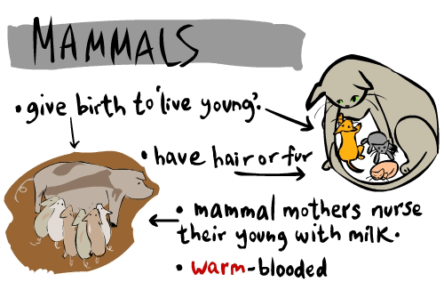
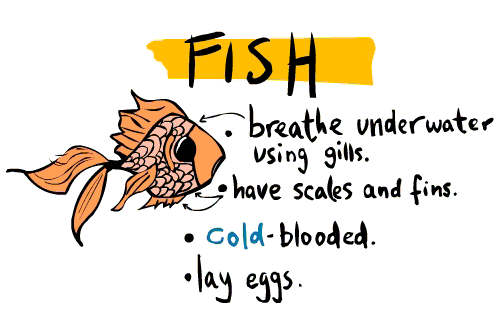
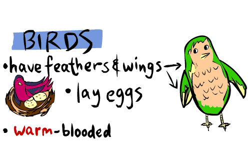
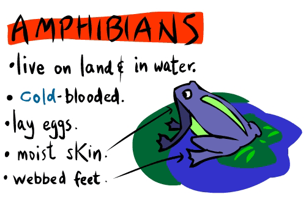
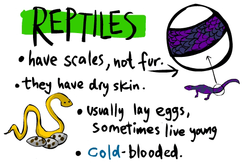
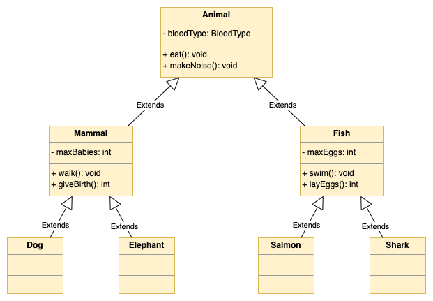

# [Class 05 - Animal Kingdom](https://redi-school.github.io/intermediate-java/05-oop-2-inheritance-encapsulation/)

## Description

In this assignment, you will step back a little and view OOP from the perspective of an elementary-school science teacher.

First, you will create a class hierarchy representing the animal kingdom, then will add some behaviours to it, and finally, you will explain the concept to a class of 4th graders (just kidding!).

### Overview

[Biology Taxonomy](https://en.wikipedia.org/wiki/Taxonomy_(biology) ){:target="_blank"} and Object-Oriented Programming have a lot in common. The main idea is to classify and group elements based on their commonality.

Take at look at the images below, which are examples of animal groups and some recurring characteristics:

|  |   |
| :---: | :---: |
|  |  |
|  | |

Based on this information, we could design a Class hierarchy as the UML diagram below:



Follow the instructions below to create the corresponding Java code.

## Tasks
  
### Step 1 - Define the Animal class
Let's create the base class of our Animal Kingdom
1. Create a class called 'Animal'
2. Create an attribute called `bloodType`
   - the attribute must be of type `BloodType` (the enumeration is already provided for you)
   - the variable must be `private` and `final`
3. Define a constructor
   - it must receive the `bloodType` value as a parameter
4. Define a getter method for the `bloodType` property
   - don't define a setter! (the variable is `final`, thus read-only)
5. Define a method called `eat`
   - the method should return `void`
   - the method should print "_chomp chomp_" in the console output
6. Define a method called `makeNoise`
   - the method should return `void`
   - the method should print "_making some noise_" in the console output
    
### Step 2 - Define the Mammal class
Let's create a derived class to represent the Mammals group 
1. Create a class called 'Mammal'
   1. It must extend from the Animal class
   2. It has a new attribute called `maxBabies`
      - the attribute must be of type `int`
      - the variable must be `private` and `final`
   3. It has a constructor
      - it receives `maxBabies` as a parameter
      - it passes `BloodType.WARM` to the constructor of the superclass
      - it uses the `maxBabies` value to initialize the corresponding property
   4. It should define a getter method for the `maxBabies` property
      - don't define a setter! (the variable is `final`, thus read-only)
   5. It defines a new method called `walk`
      - it returns `void`
      - it prints "_going for a walk_"
   6. It defines a new method called `giveBirth`
      - the method should return an `int`, that represents the number of spawned babies 
      - the number of spawned babies should be a random number between 1 and `maxBabies`
2. Now, create a class called 'Dog'
   1. It must extend from the Mammal class
   2. It has a default constructor
      - it passes `24` to the constructor of the superclass (`maxBabies`)
   3. It overrides the method `makeNoise` from the Animal class
      - the method should print "_woof woof_" in the console output
   4. It overrides the method `eat` from the Animal class
      - the method should print "_This bone is delicious_" in the console output
3. Finally, create a class called 'Elephant'
   1. It must also extend from the Mammal class
   2. It has a default constructor
      - it passes `2` to the constructor of the superclass (`maxBabies`)
   3. It overrides the method `makeNoise` from the Animal class
      - the method should print "_bahruuuuuuhhhhaaaaa_" in the console output
   4. It overrides the method `eat` from the Animal class
      - the method should print "_This hay is delicious_" in the console output
      
### Step 3 - Define the Fish class
Let's create a derived class to represent the Fish group
1. Create a class called 'Fish'
   1. It must extend from the Animal class
   2. It has a new attribute called `maxEggs`
      - the attribute must be of type `int`
      - the variable must be `private` and `final`
   3. It has a constructor
      - it receives `maxEggs` as a parameter
      - it passes `BloodType.COLD` to the constructor of the superclass
      - it uses the `maxEggs` value to initialize the corresponding property
   4. It should define a getter method for the `maxBabies` property
      - don't define a setter! (the variable is `final`, thus read-only)
   5. It defines a new method called `swim`
      - it returns `void`
      - it prints "_keep on swimming_"
   6. It defines a new method called `layEggs`
      - the method should return an `int`, that represents the number of produced eggs
      - the number of spawned babies should be a random number between 1 and `maxEggs`
2. Now, create a class called 'Salmon'
   1. It must extend from the Fish class
   2. It has a default constructor
      - it passes `2800` to the constructor of the superclass (`maxEggs`)
   3. It overrides the method `layEggs` from the Fish class
      - in the first time that is called, it performs the logic from the superclass
      - after the first time, it must return 0 (salmon can lay eggs only once)
      - hint: you can use a private variable to control the amount of times the method is called ;)
   4. It overrides the method `eat` from the Animal class
      - the method should print "_This small pray is delicious_" in the console output
3. Finally, create a class called 'Shark'
   1. It must also extend from the Fish class
   2. It has a new attribute called `isOviparous`
      - the attribute must be of type `boolean`
      - the variable must be `private` and `final`
   3. It has a constructor
      - it receives `isOviparous` as a parameter (only 30-40% of sharks lay eggs)
      - it passes `20` to the constructor of the superclass (`maxEggs`)
   4. It overrides the method `layEggs` from the Fish class
      - if the `isOviparous` property is set to `true`, perform the logic from the parent class
      - the method should return 0 otherwise
   5. It overrides the method `eat` from the Animal class
      - the method should print "_This human is delicious_" in the console output

### Step 4 - Use the classes altogether!

This step is pretty easy.
1. Copy the given code below to your `main` method
2. Then, run it and evaluate what it is doing (comments will help you understand)
3. Finally, consider the following questions:
   1. Is it logically correct to create instances of Animal, Mammal and Fish classes, as the provided code does?
   2. What you could change in the code to avoid the use of `instanceof` and `Casting`?
   3. Regarding the hierarchy, would you say it's ok to define the method `layEggs` inside the `Fish` class, considering not all sharks lay eggs? How would you improve that?

```java
   public static void main(String[] args) {

      // The Animal Kingdom list
      List<Animal> animalKingdom = new ArrayList<>();
      // Adding some animals
      animalKingdom.add(new Animal(BloodType.WARM));
      animalKingdom.add(new Animal(BloodType.COLD));
      animalKingdom.add(new Mammal(15));
      animalKingdom.add(new Dog());
      animalKingdom.add(new Elephant());
      animalKingdom.add(new Fish(1000));
      animalKingdom.add(new Salmon());
      animalKingdom.add(new Shark(false));
      // printing information from all animals
      for (Animal animal : animalKingdom) {

         System.out.println("----------------------------------");
         // gets the name of the most specific class type
         String className = animal.getClass().getSimpleName();
         System.out.println(className.toUpperCase());
         // printing some information from Animal class
         System.out.println("Blood: " + animal.getBloodType());
         System.out.print("Sound: ");
         animal.makeNoise();
         System.out.print("Eat: ");
         animal.eat();
         // printing extra information from extended classes
         if (animal instanceof Mammal) {
            Mammal m = (Mammal) animal;
            System.out.println("Max Babies: " + m.getMaxBabies());
            System.out.print("Walk: ");
            m.walk();
            System.out.println("Give Birth generated: "+m.giveBirth()+" children");
         }
         if (animal instanceof Fish) {
            Fish f = (Fish) animal;
            System.out.println("Max Eggs: " + f.getMaxEggs());
            System.out.print("Swim: ");
            f.swim();
            System.out.println("Lay Eggs generated: "+f.layEggs()+" eggs");
         }
      }
      System.out.println("----------------------------------");
   }
```

## Wants a Challenge? (Optional)
1. Analyse and implement the other animal groups (Birds, Amphibians and Reptiles)
2. Think about the exceptional case of [Platypuses](https://en.wikipedia.org/wiki/Platypus ){:target="_blank"} and [Echidnas](https://en.wikipedia.org/wiki/Echidna ){:target="_blank"}, which are **Mammals who lay eggs**.
  - How would you do to implement these two classes without changing the parent classes?
  - If you could change the hierarchy to accommodate this exception, what you would change?